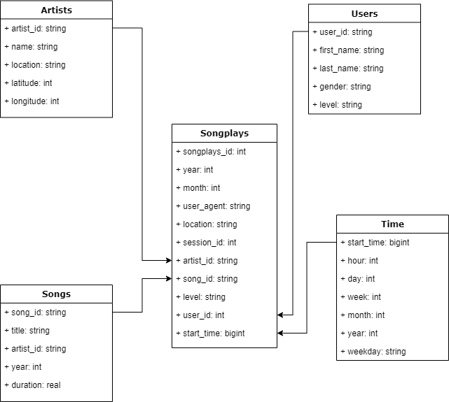

# Data pipeline with Apache Airflow and AWS Redshift

## Purpose/Goals

This project is used as an exercise to verify the concepts learned in the fifth module of the Data Engineering Nanodegree on Udacity.

*Sparkify* is a music app in need of data pipline to gather information about ongs and events streamed in the service.

Raw data are stored on S3 buckets, while the ETL process is performed by a data pipeline designed in Apache Airflow.

A star schema data model for `sparkifydb` database has been implemented conceptually with the definition of fact and dimension tables. 
The database is hosted on AWS Redshift, a popular cloude data warehouse solution for big data.

## Schema design

### Main design

The data lake `sparkifydd` holds information about songs played and relative metadata. The star schema is made of:
   - *fact table*: `songplays`
   - *dimension tables*: `songs`, `users`, `time` and `artists`

The Airflow pipeline uses custom operators to peform specific actions:

   - `StageToRedshiftOperator`: copy data from JSON files to staging tables in `sparkifydb`
   - `LoadFactOperator`: load data from staging table to fact table. It is possible to append data or delete-load by chaning the *append_mode* parameter
   - `LoadDimensionOperator`: load data from staging table to dimension tables. It is possible to append data or delete-load by chaning the *append_mode* parameter
   - `DataQualityOperator`: run QC check specified in the main script on the star schema to make sure that data are compliant with requirements

The main DAG is setup with the following default arguments:
   - start_date
   - num_retry set to 3
   - retry_delay of  5 minutes
   - run once every hour
   - catchup disabled
    
Two methods take care of ingesting the raw files in JSON format:
   - For the song files, it is possible to easily infer the schema.
   - The log files are ingested by manually defying the schema.
 
The data manipulation is performed via SL command hosted in `/plugins/helpers` folder.

## How to run the project

### Prerequisites:

An active subscription to AWS, an AWS Redshift cluster open to the public and Docker are mandatory requirements to run the project.

Once this is done, it is necessary to setup the Airflow UI and some useful connections:
   - Follow this tutorial to setup the [Airflow via Docker](http://airflow.apache.org/docs/apache-airflow/stable/start/docker.html)
   - Once the webserver is running, access *Admin > Connections* to create:
       - `aws_credentials`: connection to AWS using your personal credentials
       - `redshift`: connection to the Redshift cluster 

The Airflow UI should pick up the DAG as soon as the session is live. 

### Execute the DAG

Executing a job in Airflow UI is fairly simple. Once the DAG is visible and no clear errors are highlighted in the web interface,
one has to change the DAG switch to **ON**. The hourly scheule will automatically pick up the job.

When the ETL is completed, terminate the cluster via AWS Console.

 
## Files in the repo

Important files inthe repository are:

- `dags/udac_example_dag.py`: main script for the DAG with default arguments and declaration of task dependencies

- `imgs`: contains the PNG of the star schema.

- `plugins/helpers`: contains SQL code to perform data manipulation and populate the fact/dimension tables

- `plugins/operators`: contain files that describe and implement custom operators used inthe main DAG
